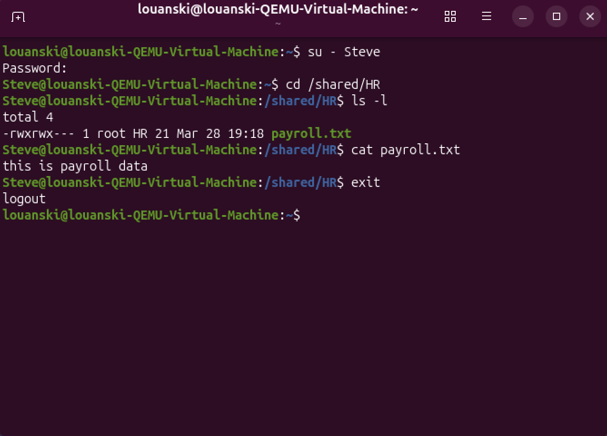
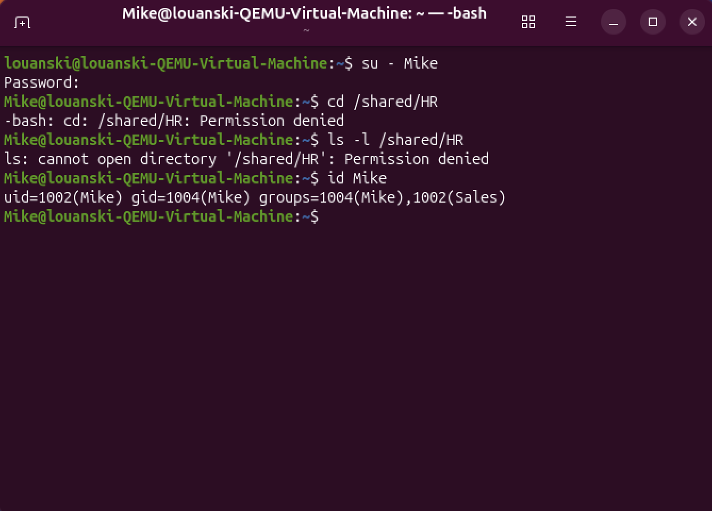
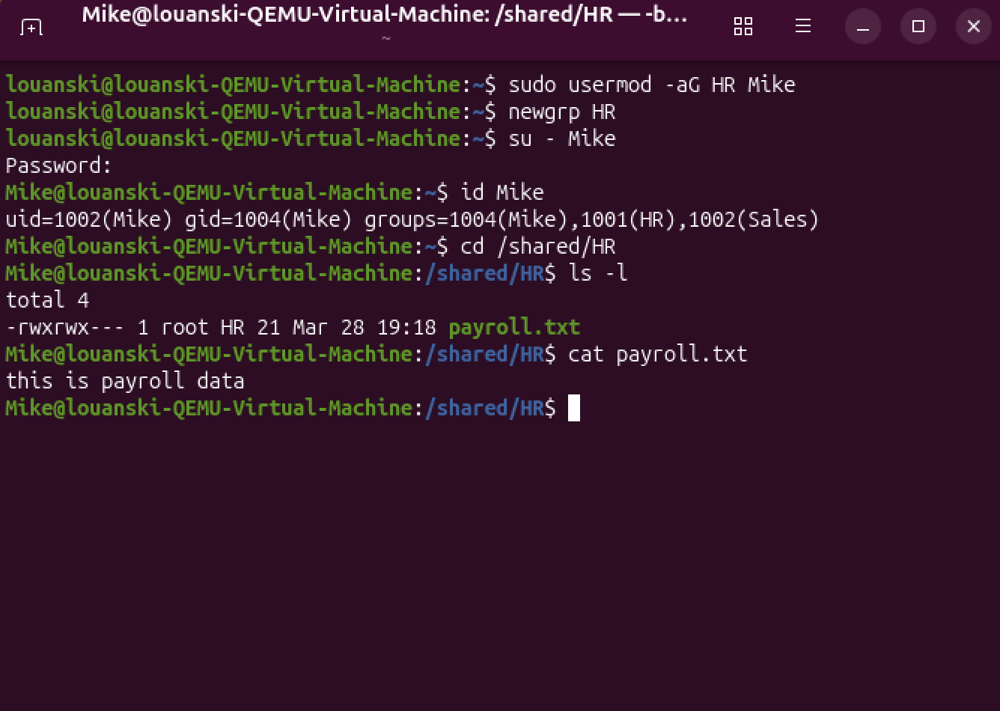

# Linux User & Permission Management

## Objective
Simulate and troubleshoot a Linux file access issue where a user cannot access a shared department directory. Create users and groups, configure permissions, intentionally break access, then restore proper access using Linux ownership and permission commands.

---

## Lab Environment
- Ubuntu Desktop Virtual Machine

---

## Steps

### 1. Verified Current User and Created Groups
Opened terminal and verified current user using `whoami` and working directory using `pwd`. Created department groups using `groupadd` and verified their existence using `getent group`.

**Command Used:**
```
whoami
```

```
pwd
```

```
sudo groupadd [group]
```


---

### 2. Created Users
Created users with a home directory using `useradd -m` and assigned Bash as their default shell using `-s /bin/bash` to allow interactive login and command execution. Configured user authentication by setting passwords using `passwd`. 

**Command Used:**
```
sudo useradd -m -s /bin/bash [user]
```

```
sudo passwd [user]
```


---

### 3. Added Users to Groups
Added the newly created users using `usermod` to newly create groups for role-based access and verified membership of the users using `id`.

**Command Used:**
```
sudo usermod -aG [group] [user]
```

```
id [user]
```


---

### 4. Created Shared Directory and Test File
Created a shared directory using `mkdir` and created a sample file using `touch` and `nano` to write contents to simulate department data used for access control testing. Verified contents inside new file using `cat`.

**Command Used:**
```
sudo mkdir -p /shared/HR
```

```
sudo touch /shared/HR/payroll.txt
```

```
sudo nano /shared/HR/payroll.txt
```

```
cat payroll.txt
```


---

### 5. Assigned Ownership and Directory Permissions
Assigned ownership of the shared directory to the root user and HR group using `chown`, then configured permissions to 770, to allow access only to the owner and group while restricting all other users using `chmod`. Verified directory ownership and permissions using `ls -ld`. Attempted to list directory contents using `ls -l` and received a permission denied error due to current user not being part of the assigned group, resulting in restricted access.

**Command Used:**

```
sudo chown -R root:HR /shared/HR
```

```
sudo chmod -R 770 /shared/HR
```

```
ls -ld /shared/HR
```

```
ls -l /shared/HR
```


---

### 6. Tested Access with Authorized User
Switched to user `Steve` using `su` and changed directory to `/shared/HR` using `cd`. Confirmed assigned access permission in the directory for the assigned group `HR` using `ls -l` granting access. 

**Command Used:**
```
su - [user]
```

```
cd /shared/HR
```

```
ls -l 
```

```
cat payroll.txt
```



---

### 7. Tested Access with Unauthorized User
Switched to user `Mike` using `su` and changed directory to `/shared/HR` using `cd` and was denied access. Additionally, permission was denied for attempting to access shared folder. Mike is part of the Sales department and directly permission was set to 770, restricting access to owner and group only. Confirmed user group membership did not include HR using `id`


**Command Used:**
```
su - [user]
```

```
cd /shared/HR
```

```
ls -l 
```

```
id [user]
```



---

### 8. Grant Temporary Access
Temporarily added user Mike to the HR group using `sudo usermod` to grant access to the shared directory for testing and validation purposes. Applied the new group membership in current session using `newgrp`. Proceeded to confirm the new group and permissions and successfully granted temporary access.

**Command Used:**
```
sudo usermod -aG [group] [user]
```

```
newgrp [group]
```

```
su - [User]
```

```
id [user] 
```

```
cd /shared/HR
```

```
ls -l
```

```
cat [file]
```



---

