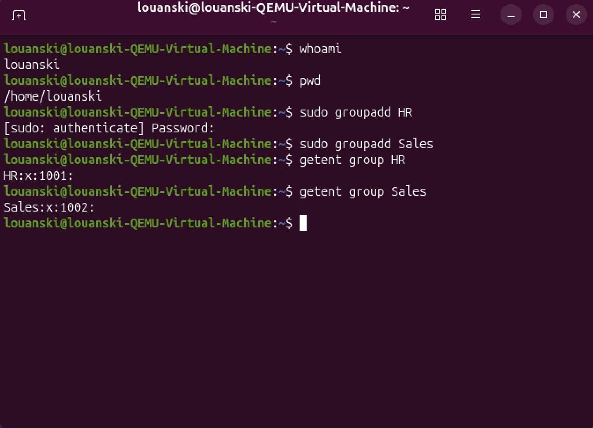
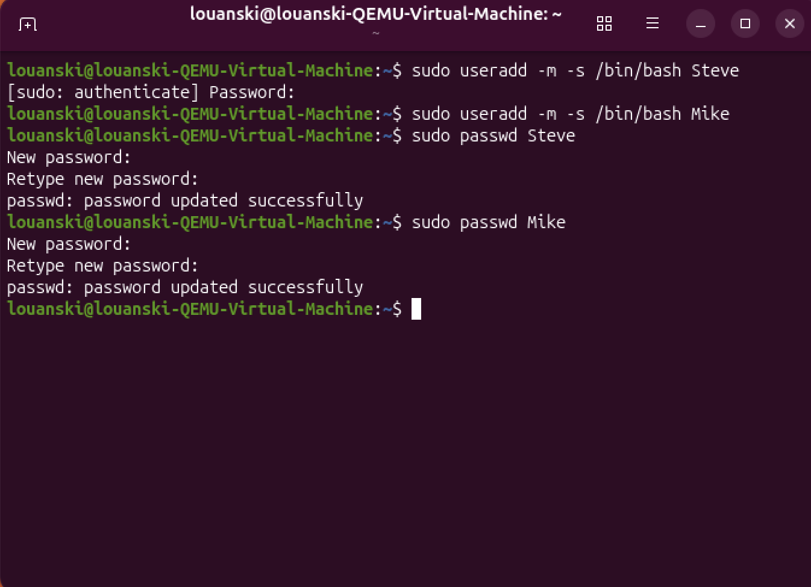
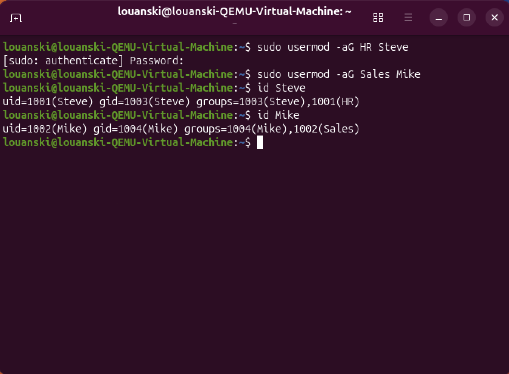
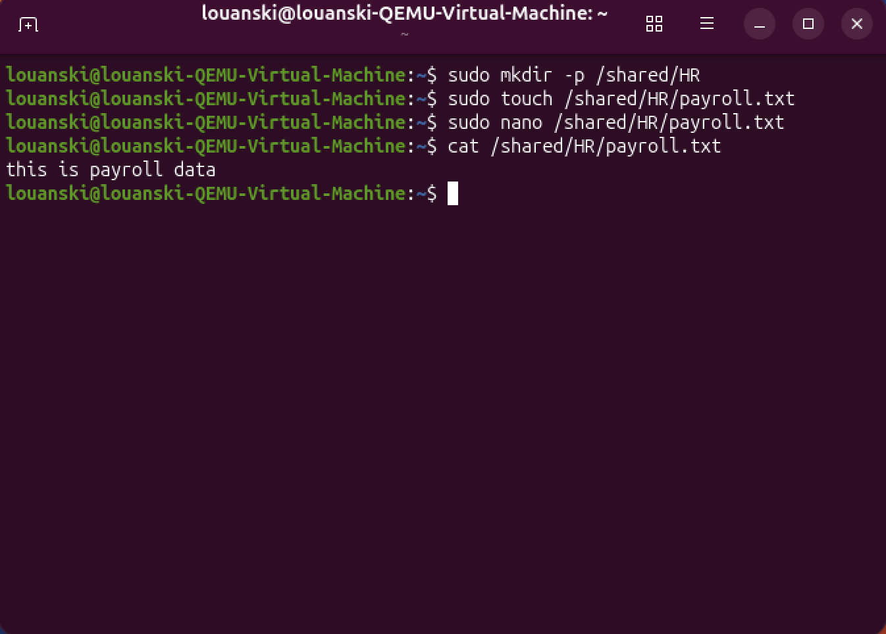
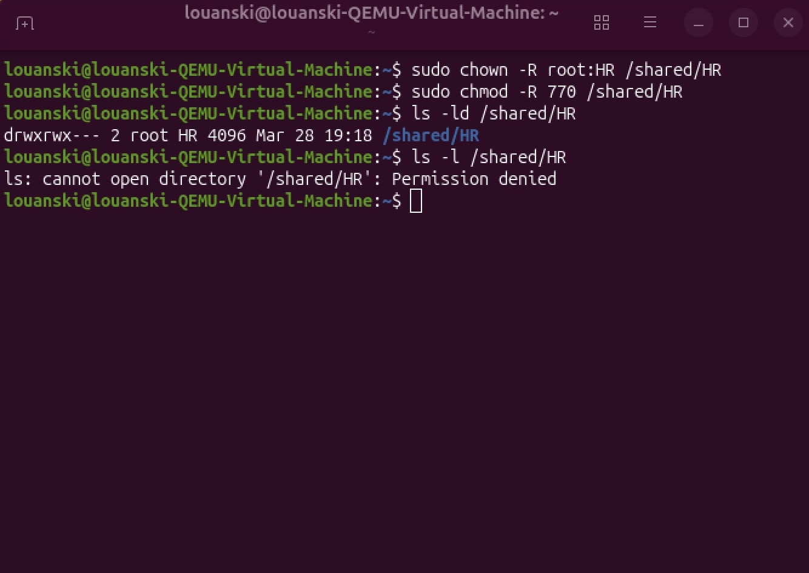

# Linux User & Permission Management

## Objective
Simulate and troubleshoot a Linux file access issue where a user cannot access a shared department directory. Create users and groups, configure permissions, intentionally break access, then restore proper access using Linux ownership and permission commands.

---

## Lab Environment
- Ubuntu Desktop Virtual Machine

---

## Steps

### 1. Verified Current User and Created Groups
Opened terminal and verified current user using `whoami` and working directory using `pwd`. Created department groups using `groupadd` and verified their existence using `getent group`.

**Command Used:**
```
whoami
```

```
Pwd
```

```
sudo groupadd HR
```
```
sudo groupadd Sales
```



---

### 2. Created Users
Created users with a home directory using `useradd -m` and assigned Bash as their default shell using `-s /bin/bash` to allow interactive login and command execution. Assigned password to users using `passwd`. 

**Command Used:*
```
sudo userdd -m -s /bin/bash [user]
```

```
sudo passwd [user] [password]
```



---

### 3. Added Users to Groups
Added the newly created users using `usermod` to newly create groups for role-based access and verified membership of the users using `id`.

**Command Used:**
```
sudo usermod -aG [group] [user]
```

```
id [user]
```



---

### 4. Created Shared Directory and Test File
Created a shared directory using `mkdir` and added a sample file using `touch` and `nano` to write contents to simulate department data used for access control testing. Verified contents inside new file using `cat`.

**Command Used:**
```
sudo mkdir -p /shared/Hr
```

```
sudo touch /shared/Hr/paystubs.txt
```

```
sudo nano /shared/Hr/paystubs.txt
```

```
cat /shared/Her/paystubs.txt
```



---

### 5. Assigned Ownership and Directory Permissions
Assigned ownership of the shared directory to the root user and HR group using `chown`, then configured permissions to allow access only to the owner and group while restricting all other users using `chmod`. Verified directory ownership and permissions using `ls -ld`, confirming the directory was assigned to root:HR with 770 permissions which grants full access. Attempted to list directory contents and received a permission denied error using ` ls -l`.

**Command Used:**

```
sudo chown -R root:HR /shared/HR
```

```
sudo chmod -R 770 /shared/HR
```

```
ls -ld /shared/HR
```

```
ls -l /shared/HR
```



---

### 6. 
